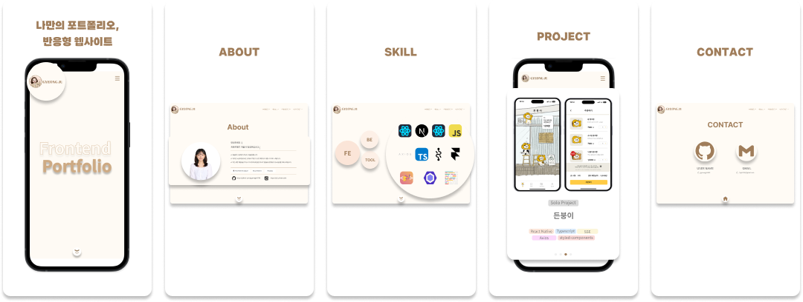

# Gyeongju Portfolio

### 프로젝트 소개

> **Gyeongju Portfolio** 는 개인 Portfolio 용도로 제작한 반응형 웹사이트입니다.   
> Solo Project 로, 기획과 디자인 그리고 개발까지 모두 혼자 진행하였습니다.

### 진행 기간

📄 기획
- **2024.04.02 - 2024.04.20**

📚 디자인
- **2024.04.20 - 2024.05.10**

👩🏻‍💻 개발
- **2024.05.10 - 2024.05.31**

### 기술 스택

- 
  
  
  

### 구현한 기능

- Main page UI
- About page UI
- Skill page UI
- Project page UI
  - `Swiper` 를 사용하여 이미지 슬라이더 개발
- Contact page UI
  - `mailto:`프로토콜을 사용하여 Gmail 아이콘 클릭 시 새 이메일 작성 창이 열리도록 구현
  - `copyToClipboard` 함수를 사용하여 User Name, Gmail 클릭 시 클립보드에 복사되도록 구현

### 배포 링크

- [🔗 배포 사이트로 이동하기](https://portfolio.jung-gyeongju.com)

### 프로젝트 후기 🙇🏻‍♀️

- 전체 개발 프로세스 이해 증진
  - 이 프로젝트를 통해 기획, 디자인, 개발의 모든 단계를 혼자서 진행하며 전체 개발 프로세스에 대한 깊은 이해를 얻게 되었습니다.
  - 각각의 단계에서 발생할 수 있는 잠재적인 문제와 해결 방안을 예측하는 데 큰 도움이 되었습니다.
- 컴포넌트 분리의 중요성
  - 프로젝트를 진행하면서 컴포넌트 분리의 중요성을 깨달았습니다.
  - 모든 페이지에 적용되는 Scroll 버튼이나 Skill tag 같은  UI 요소들을 재사용 가능한 컴포넌트로 분리함으로써 코드의 가독성과 유지보수성을 크게 향상시킬 수 있었습니다.
  - 이를 통해 중복 코드를 줄이고, 변화가 필요할 때 특정 컴포넌트만 수정하면 되는 효율적인 개발 환경을 구축할 수 있었습니다.
- 데이터 파일 분리의 필요성
  - 데이터 파일을 별도로 분리하여 관리하는 것이 얼마나 중요한지 실감했습니다.
  - 개발하는 동안 데이터의 수정이나 업데이트가 빈번하게 이루어졌는데, 데이터 파일을 분리함으로써 다른 부분에 영향을 주지 않고 손쉽게 수정할 수 있었습니다.
  - 이는 코드의 명확성과 유지보수성을 높이는 데 큰 도움이 되었습니다.

### Documents

- [Notion](https://www.notion.so/gyeongju/GyeongJu-Portfolio-345d1d6309144c1a9fd09af8fa081209?pvs=4)
- [Figma](https://zrr.kr/ZM9j)
